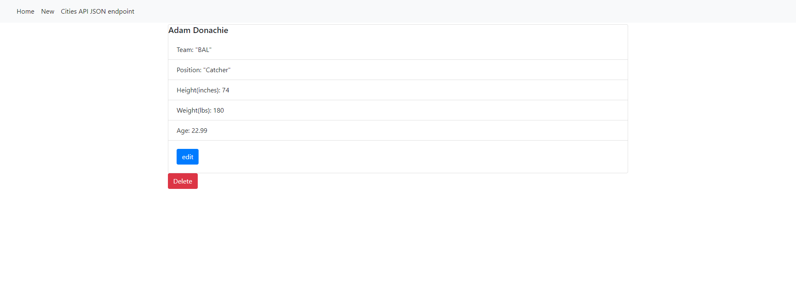
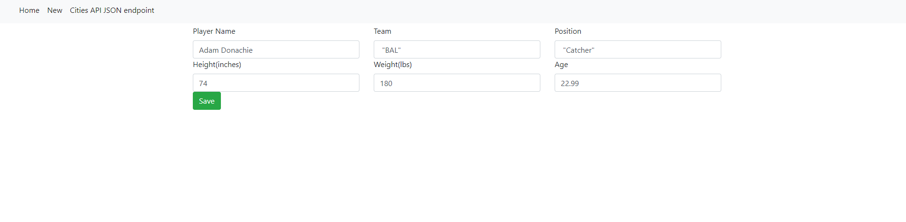
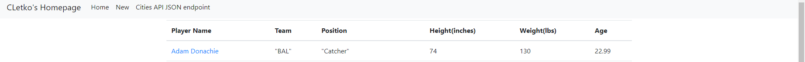

#Project Description
This is the first part of the final project.  Using my own csv file to generate a MYSQL database

#Pycharm tables

#Homepage

#Data Record

#New Record

#Edited Record

#Deleted Record (Adam Donachie)
