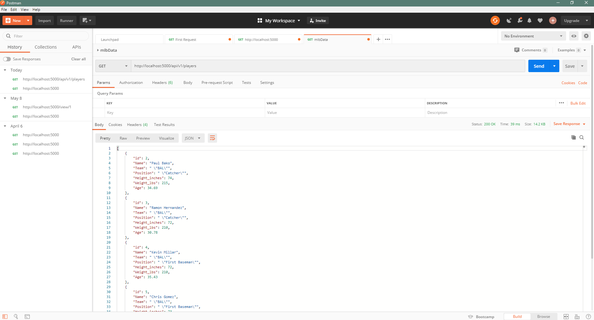
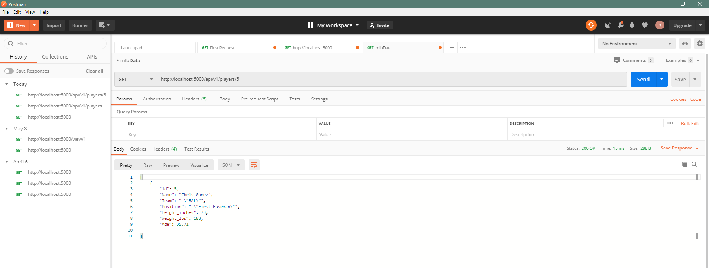
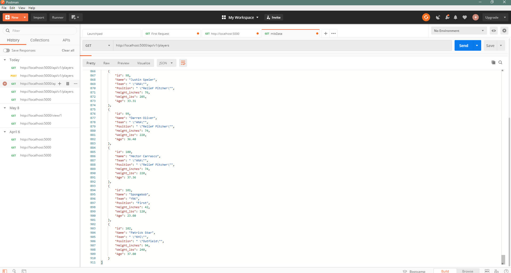
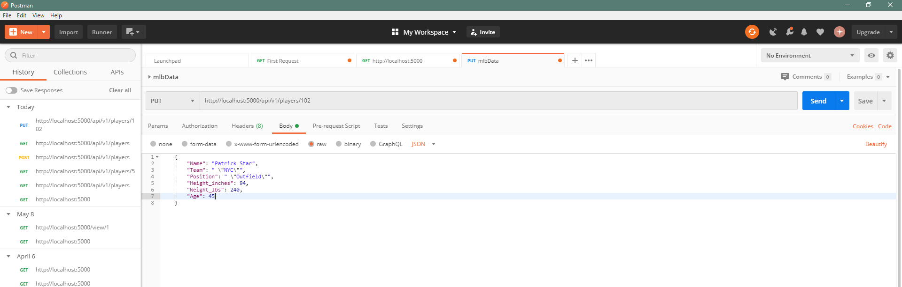
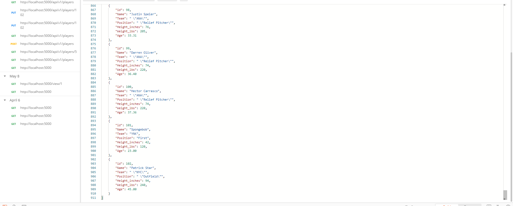
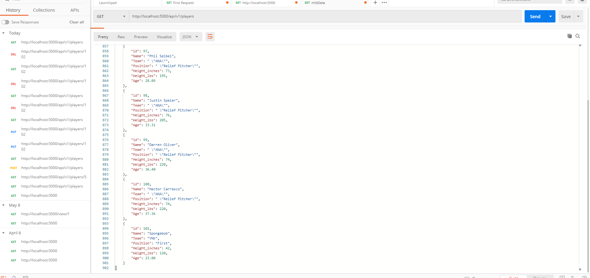

# Project Description
This is the second part of the final project.  Using my own csv file to generate a MYSQL database
Then using postman to call my APIs.

# Postman All Listings

# Get Record

# New Record

# Edit Record

# Deleted Record

